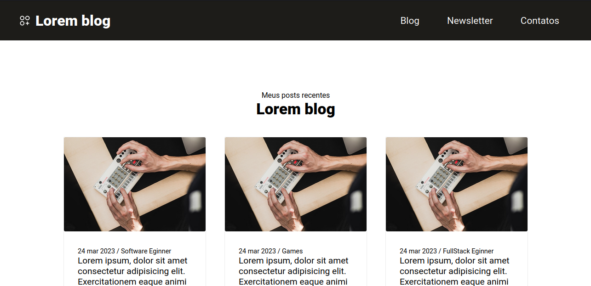
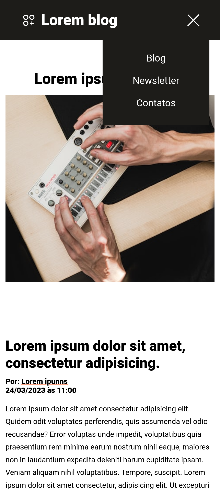

<h1 align="center"> Blog-site </h1>

<p align="center">
  <a href="#-tecnologias">Tecnologias</a>&nbsp;&nbsp;&nbsp;|&nbsp;&nbsp;&nbsp;
  <a href="#-projeto">Projeto</a>&nbsp;&nbsp;&nbsp;|&nbsp;&nbsp;&nbsp;
  <a href="#rodar-projeto">Como rodar o projeto</a> |
  <a href="#rotas">Rotas disponíveis da aplicação</a> |
  <a href="#memo-licença">Licença</a>
</p>

<p align="center">
  
</p>

<br>

<p align="center">
<h1>Desktop:</h1>
  
 
<h1>Mobile:</h1>
  
</p>

## 🚀 Tecnologias

Esse projeto foi desenvolvido com as seguintes tecnologias:

- React
- HTML
- CSS Modules
- JavaScript
- React Router
- ViteJS

## 💻 Projeto

O objetivo deste projeto foi criar um blog/site para divulgação de conteúdo. Ao clicar no botão "Leia mais", o usuário será redirecionado para uma nova página com o conteúdo completo do post. Além disso, haverá uma seção de comentários, na qual os usuários poderão escrever seus próprios comentários sobre o post, dar "likes" em outros comentários e até mesmo deletar seus próprios comentários, se necessário. 

A construção deste projeto foi um desafio muito enriquecedor, pois pude colocar em prática diversos conceitos que vinha aprendendo, como a criação de rotas utilizando o React Router e o uso de estados com o useState. 

## ⚒ Como rodar o projeto <a id="rodar-projeto"></a>

Antes de começar, você vai precisar ter instalado em sua máquina as seguintes ferramentas:
[Git](https://git-scm.com), [Node.js](https://nodejs.org/en/). 
Além disto é bom ter um editor para trabalhar com o código como [VSCode](https://code.visualstudio.com/)

### Em seguida no terminal faça o clone do projeto:
```
git clone https://github.com/MarceloHenriqueDoriaFigueiredo/Blog-project.git
```

### Acesse a pasta do projeto pelo seu terminal ou pode usar também o terminal do vscode: 
```
cd Blog-project
```

### Dentro da pasta do projeto execute o comando:
```
npm install
```
ou

```
npm i
```

### Depois de executado ainda na pasta do projeto execute o comando:
```
npm run dev
```
### Depois acesse pelo navegador o link que o terminal indicara para iniciar o projeto. (Observacao: o link abaixo foi gerado no meu terminal local, o mesmo pode ser que mude quando voce executa o projeto em sua maquina):
```
http://localhost:5173/
```

## 🛣️ Rotas disponíveis da aplicação <a id="rotas"></a>
  
  1. "/" - Home da aplicação
  ```
  http://localhost:5173/
  ```
  2. "/Post" - Tela com o conteudo completo do post e comentarios
  ```
  http://localhost:5173/Post
  ```

## :memo: Licença

Esse projeto está sob a licença MIT.

---
